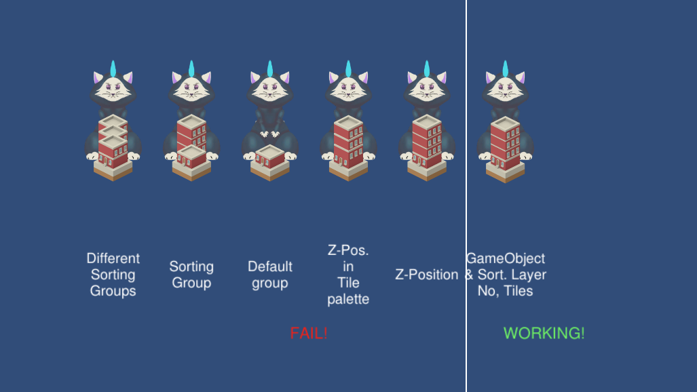
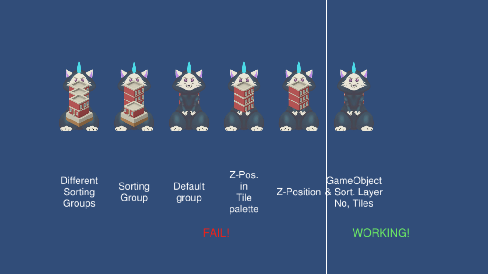

# Test Kenny Assets with Unity Tilemaps
A simple test scene for experiments showing some how Sorting Groups and Z-Position for tilemaps work (or not work) and and a script that re-calculates the tile dynamically

Some other notes on working with tilemaps:

- make sure all GameObjects are scalled to 1 1 1, if you like to change the Scale change it at the Sprite > Pixel per Unit value (better: scale the image in some other software).
- make sure the Pivit-Point is at the bottom of your Character and placed correctly on your Tilemaps.

## Multi level with big character problem (the Meowzilla-problem)
As far as I know it is not possible to group multiple tiles on different layers in a tilemap or different tilemaps. This makes it impossible to use tile maps for a Game with a playable character that is bigger than one level of a building.

See Screenshots:

